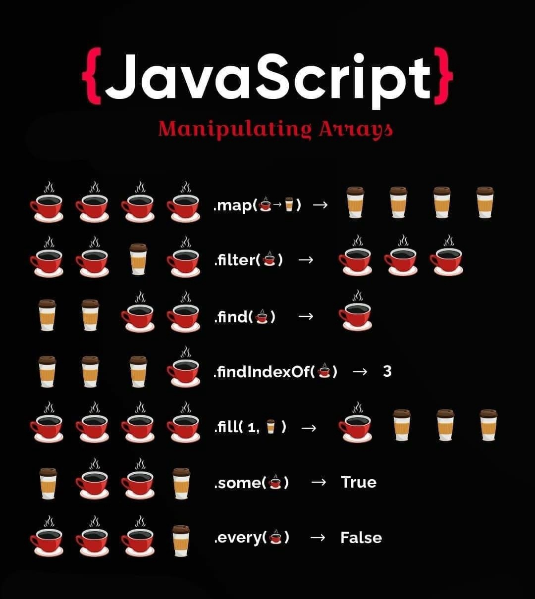

`map` создаёт новый массив, меняя каждый элемент массива индивидуально. 

`filter` создаёт новый массив убирая элементы, которые не соответствуют условиям. 

`reduce` в свою очередь, берёт все элементы в массиве, складывает их в новое значение.

эти и другие методы наглядно 

### Примечание про reduce

В `reduce` всегда надо указывать начальное значение. Потому что
1. Если массив будет пустой выкинется ошибка
2. Если массив будет длинной 1, что аккумулятору  присвоится это элемент и функция `reduce` завершится без выполнения `callback` функции

#js #js/array-methods
