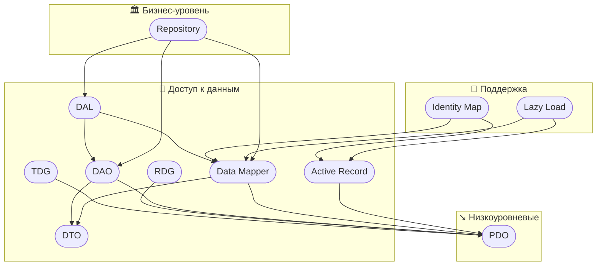
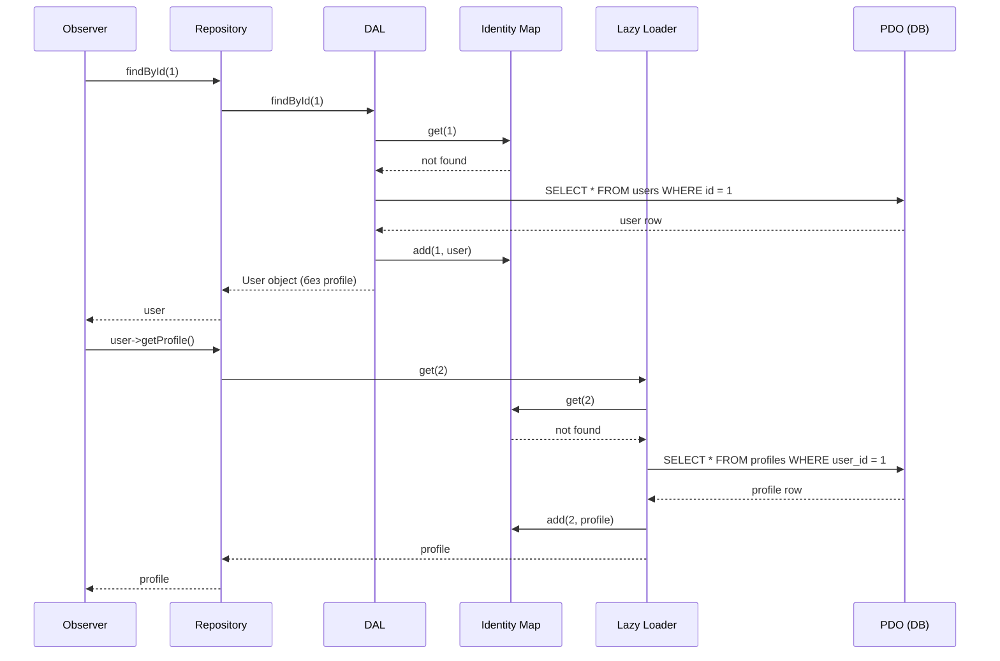

#php/db #паттерны #алгоритмы 

## PDO (PHP Data Objects)
**Что это**: встроенный в PHP способ безопасной работы с БД через подготовленные выражения.
**Зачем**: доступ к БД, защита от SQL-инъекций.

```php
$pdo = new PDO('mysql:host=localhost;dbname=test', 'root', '');  //DSN (Data Source Name) указывает на доступы к БД
$stmt = $pdo->prepare("SELECT * FROM users WHERE id = ?"); //prepared Statement aka подготавливаемые/параметризованные запросы. ? - это placeholder. Значение туда будет передано позже
$stmt->execute([1]); //выполнение подготовленного запроса. [1] — массив параметров, который заменяет `?` в запросе
$user = $stmt->fetch(PDO::FETCH_ASSOC); //fetch извлекает одну строку результата запроса и PDO::FETCH_ASSOC возвращает ее как ассоциативный массив, где ключи — это имена колонок таблицы. 
```

Пример ответа для таблицы с колонками id, name, email:
```php
[
  'id' => 1,
  'name' => 'Илья',
  'email' => 'ilya@mail.com'
]
```

---

## DTO (Data Transfer Object)
**Что это**: простой класс только для хранения данных.
**Зачем**: передача данных между слоями без бизнес-логики.

```php
class UserDTO {
    public function __construct(
        public int $id,
        public string $name
    ) {}
}
```

Почему не использовать просто массив?
- Валидация и проверка типов. Не просто строка/число, как у массива.
- Само документирование. Все нужные поля точно будут
- Через public/protect контролируется что изменение данных будет консистентным и только теми классами которые должны то делать. 

---

## DAO (Data Access Object)
**Что это**: класс, инкапсулирующий логику доступа к данным.
**Зачем**: абстрагировать SQL-запросы и БД от бизнес-логики. Оперирует и возвращает объекты доменной модели. 

```php
class UserDAO {
    public function __construct(private PDO $db) {}

    public function findById(int $id): ?UserDTO {
        $stmt = $this->db->prepare("SELECT * FROM users WHERE id = ?");
        $stmt->execute([$id]);
        $row = $stmt->fetch();
        return $row ? new UserDTO($row['id'], $row['name']) : null;
    }
}
```

---

## TDG (Table Data Gateway)
**Что это**: паттерн, где один класс управляет одной таблицей и выполняет SQL-запросы.
**Зачем**: простой способ централизовать SQL-запросы. Это низкоуровневый шаблон который возвращает данные из БД в виде массива или примитивов
**Подробнее:** это паттерн, при котором для каждой таблицы в базе данных создается отдельный класс (шлюз), содержащий методы для выполнения операций CRUD (Create, Read, Update, Delete).

```php
class UserGateway {
    public function __construct(private PDO $db) {}

    public function insert(string $name): void {
        $this->db->prepare("INSERT INTO users (name) VALUES (?)")->execute([$name]);
    }

    public function findById(int $id): array|false {
        $stmt = $this->db->prepare("SELECT * FROM users WHERE id = ?");
        $stmt->execute([$id]);
        return $stmt->fetch(PDO::FETCH_ASSOC);
    }
}
```

---

## RDG (Row Data Gateway)
**Что это**: паттерн, с объектом который представляет одну строку таблицы с методами `save()`, `delete()` и т.д.
**Зачем**: удобная обертка над одной записью в таблице.

```php
class UserRDG {
    public function __construct(
        private PDO $db,
        public int $id,
        public string $name
    ) {}

    public function save(): void {
        $stmt = $this->db->prepare("UPDATE users SET name = ? WHERE id = ?");
        $stmt->execute([$this->name, $this->id]);
    }
}
```

---

## Data Mapper
**Что это**: паттерн для разделения между объектом и SQL-запросами: объект чистый, SQL — отдельно.
**Зачем**: архитектурная чистота, соблюдение SRP и тестируемость.
**Подробнее:** паттерн, при котором объект (маппер) отвечает за преобразование данных между объектами и базой данных, позволяя разделить бизнес-логику и логику доступа к данным. Это обеспечивает лучшую масштабируемость и тестируемость кода, но приходится отдельно писать операции с базой и в отдельном файле маппер между бизнес-сущностями и сущностями из БД

```php
class User {
    public function __construct(public int $id, public string $name) {}
}

class UserMapper {
    public function __construct(private PDO $db) {}

    public function findById(int $id): ?User {
        $stmt = $this->db->prepare("SELECT * FROM users WHERE id = ?");
        $stmt->execute([$id]);
        $row = $stmt->fetch();
        return $row ? new User($row['id'], $row['name']) : null;
    }

    public function save(User $user): void {
        $stmt = $this->db->prepare("UPDATE users SET name = ? WHERE id = ?");
        $stmt->execute([$user->name, $user->id]);
    }
}
```

---

## Active Record
**Что это**: паттерн в котором модель содержит и данные, и методы работы с БД (`save()`, `delete()`).
**Зачем**: удобство, но нарушает SRP.
**Подробнее:** паттерн, при котором объект представляет собой строку в таблице базы данных и содержит методы для работы с данными, включая бизнес-логику. Это упрощает работу с базой данных, но может привести к нарушению принципа единственной ответственности.

```php
class User {
    private static PDO $db;

    public static function setDb(PDO $db): void {
        self::$db = $db;
    }

    public function __construct(
        public ?int $id,
        public string $name
    ) {}

    public function save(): void {
        if ($this->id) {
            $stmt = self::$db->prepare("UPDATE users SET name = ? WHERE id = ?");
            $stmt->execute([$this->name, $this->id]);
        } else {
            $stmt = self::$db->prepare("INSERT INTO users (name) VALUES (?)");
            $stmt->execute([$this->name]);
            $this->id = self::$db->lastInsertId();
        }
    }
}
```

---

## Identity Map

**Что это**: паттерн, кэш в памяти, который гарантирует, что каждый объект с одним и тем же ID существует только в одном экземпляре.
**Зачем**: избежание повторных загрузок из БД и дублирования объектов.

```php
class IdentityMap {
    private array $entities = [];

    public function get(int $id): ?User {
        return $this->entities[$id] ?? null;
    }

    public function add(User $user): void {
        $this->entities[$user->id] = $user;
    }
}
```

---

## Lazy Load

**Что это**: отложенная загрузка данных — объект содержит "заглушку", а данные загружаются при первом обращении.
**Зачем**: экономия ресурсов и ускорение начальной загрузки.

```php
class Profile {
    public function __construct(public int $id, public string $bio) {}
}

class User {
    private ?Profile $profile = null;

    public function __construct(
        public int $id,
        public string $name,
        private PDO $db
    ) {}

    public function getProfile(): Profile {
        if (!$this->profile) {
            $stmt = $this->db->prepare("SELECT * FROM profiles WHERE user_id = ?");
            $stmt->execute([$this->id]);
            $row = $stmt->fetch();
            $this->profile = new Profile($row['id'], $row['bio']);
        }
        return $this->profile;
    }
}
```

---

## DAL (Data Access Layer)


**Что это**: слой приложения, отвечающий за доступ к данным. Может включать DAO, TDG, Mapper и др.
**Зачем**: отделение бизнес-логики от хранения данных.

```php
// DAL может быть структурирован как отдельное пространство имён или директория,
// где находятся DAO, Mapper и связанные классы работы с БД.
namespace App\DAL;

class UserDAL {
    private UserDAO $dao;

    public function __construct(PDO $db) {
        $this->dao = new UserDAO($db);
    }

    public function getUserName(int $id): ?string {
        $user = $this->dao->findById($id);
        return $user?->name;
    }
}
```

---

## Сравнение

| Паттерн/Концепт                | Доступ к БД   | Представление данных  | Уровень абстракции                 | Комментарий                     |
| ------------------------------ | ------------- | --------------------- | ---------------------------------- | ------------------------------- |
| **PDO (PHP Data Objects)**     | Да            | Нет                   | Низкий                             | Базовый инструмент              |
| **DTO (Data Transfer Object)** | Нет           | Да                    | Низкий Уровень доступа к данным    | Только хранение данных          |
| **DAO (Data Access Object)**   | Да            | Нет/DTO               | Средний Уровень доступа к данным   | Абстракция над SQL              |
| **TDG (Table Data Gateway)**   | Да            | Ассоц. массив         | Средний Уровень доступа к данным   | Один класс — одна таблица       |
| **RDG (Row Data Gateway)**     | Да            | Объект строки         | Средний Уровень доступа к данным   | Методы над строкой              |
| **Data Mapper**                | Да (опосред.) | Чистые объекты        | Высокий Уровень доступа к данным   | Разделение логик                |
| **Active Record**              | Да            | Объект + SQL внутри   | Средний Уровень доступа к данным   | Всё в одном — просто, но грязно |
| **Identity Map**               | Нет           | Кэш объектов          | Средний Уровень поддержки загрузки | Гарантия уникальности в памяти  |
| **Lazy Load**                  | Да (отложено) | Частичная загрузка    | Средний Уровень поддержки загрузки | Экономия ресурсов               |
| **DAL (Data Access Layer)**    | Да            | Использует DAO/Mapper | Высокий Уровень доступа к данным   | Слой доступа к данным           |
| **Repository**                 | Нет           | Использует DAO/Mapper | Высокий Бизнесс-уровень            | Чистая бизнес-абстракция        |

Диаграмма кто с кем работает




